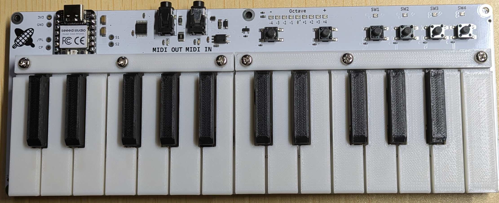

# Kino-Key25

[[README.ja.md|日本語]]

Open source piano-type keyboard MIDI controller project

## Features

- All mechanical parts are easy 3D-printable. You can also easly order to 3D printing manufactures, such as JLC3dP, etc. (we may sell mech parts in the future, but not planned)
- Software is implemented on small, cheap seeeduino xiao rp2040. Everything includes keyboard scanning is modifiable according to your preferences.
- Most of the components on the PCB is easy to buy(we may sell PCBA board for easier assembly in the future, but not planned)
